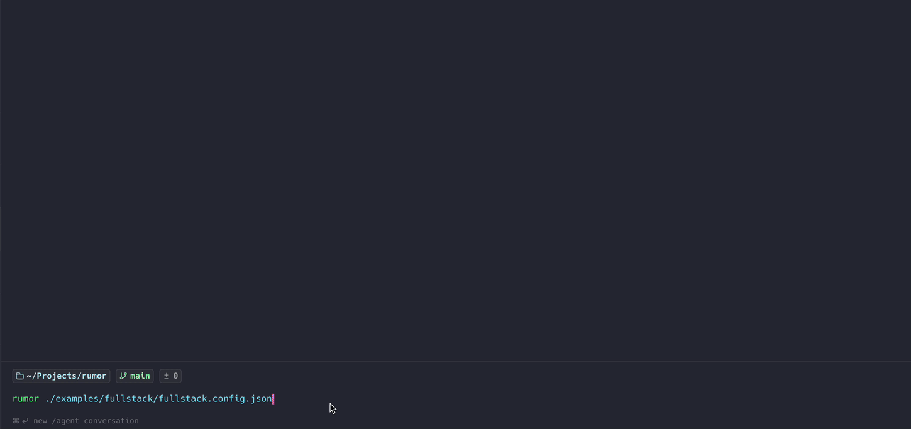

# rumor



Multi-process TUI orchestrator. Run a JSON-configured set of long-lived processes side by side in one terminal, each in its own PTY tab with full ANSI rendering and interactive input.

## Install

```bash
brew tap ornitech/tap
brew install rumor
```

## Usage

```bash
rumor [config.json] [-t|--tags TAG ...]
```

The config path is optional: with no argument, rumor loads `./rumor.json` from
the current directory. Pass an explicit path to use any other config file.

### Running a subset with tags

Give processes `tags` in the config, then pass `-t`/`--tags` to run only the
matching ones:

```bash
rumor -t backend          # run every process tagged "backend"
rumor -t backend api      # run processes tagged "backend" OR "api"
rumor -t backend,api      # same, comma-separated
rumor config.json -t backend
```

A process is selected if it carries **any** of the requested tags. Dependencies
of selected processes are pulled in automatically (transitively), so a tagged
service never hangs waiting on an untagged `dependsOn` target. If no process
matches, rumor exits with an error. A positional config path must come before
the first `-t`.

A minimal config:

```json
{
  "processes": [
    { "name": "counter", "command": "bash", "args": ["-c", "i=0; while true; do echo $i; i=$((i+1)); sleep 1; done"] },
    { "name": "repl",    "command": "python3", "args": ["-q"], "env": { "PS1": "py> " } }
  ]
}
```

See [`example.config.json`](example.config.json) for a fuller example.

## Config schema

Top level: `{ "envFiles": [ ... ], "processes": [ ... ] }`, where each entry of
`processes` is a process object.

### Top level

| Field | Type | Default | Notes |
| --- | --- | --- | --- |
| `processes` | process[] | *required* | The processes to run. Must be non-empty. |
| `envFiles` | string[] | `[]` | Global `.env` files loaded for **every** process, in order. Lowest precedence in the env merge (below each process's own `<cwd>/.env`, `envFiles`, and `env`). Relative paths resolve against the config file's directory. Use for a shared monorepo root `.env`/`.env.local` so each process doesn't have to declare it. |
| `dynamicPorts` | string[] | `[]` | Env var names that rumor resolves to free ports, allocated once per config directory (so once per git worktree) and reused on every run. Injected into every process with the **highest** precedence in the env merge and usable in `${VAR}` substitution. See [Dynamic ports](#dynamic-ports-git-worktrees). |

### Process object

| Field | Type | Default | Notes |
| --- | --- | --- | --- |
| `name` | string | *required* | Unique within the config; shown as the tab label. |
| `command` | string | *required* | Executable to spawn. Supports `${VAR}` substitution. |
| `args` | string[] | `[]` | Each entry supports `${VAR}` substitution. |
| `cwd` | string | *required* | Working directory for the spawned process. Relative paths resolve against the **config file's directory**, not where `rumor` was invoked. |
| `env` | object&lt;string, string&gt; | `{}` | Inline env vars. Highest precedence in the env merge, below only the top-level `dynamicPorts` allocations. |
| `envFiles` | string[] | `[]` | Extra `.env` files loaded in order *after* `<cwd>/.env`; later files override earlier ones. Relative paths resolve against the config file's directory. |
| `dependsOn` | dependency[] | `[]` | Readiness gates that must pass before this process starts. |
| `longLived` | bool | `true` | If `false`, a clean `exit 0` is shown as success (green) instead of a crash (red). Use for migrations and one-shot setup scripts. |
| `tags` | string[] | `[]` | Labels for selecting a subset of processes with `-t`/`--tags`. Empty/whitespace entries are ignored. |

### Dependency object (`dependsOn[]`)

| Field | Type | Notes |
| --- | --- | --- |
| `name` | string | Name of another process in this config. Cycles and self-references are rejected at load. |
| `until` | object | Exactly one readiness condition. See variants below. |

### Readiness conditions (`dependsOn[].until`)

| Key | Value type | Ready when |
| --- | --- | --- |
| `port` | u16, or `"${VAR}"` string | A TCP connect to `127.0.0.1:port` or `[::1]:port` succeeds. |
| `log` | string (regex) | The regex matches the dep's accumulated stdout/stderr. Supports `${VAR}` substitution. |
| `exit` | i32, or `"${VAR}"` string | The dep process exits with this code (typically `0` for one-shot setup). |

## Environment variable references

String fields in the config may reference environment variables with `${NAME}`.
Use `$${NAME}` to emit a literal `${NAME}`.

Substitution applies to:

- `command`
- each entry of `args`
- `dependsOn[].until.port` and `dependsOn[].until.exit` (write them as JSON
  strings, e.g. `"port": "${API_PORT}"`; literal numbers also still work)
- `dependsOn[].until.log` (the regex string)

The lookup uses, in order (later wins): the orchestrator's own env, then the
top-level (global) `envFiles`, then `<cwd>/.env`, then each per-process
`envFiles` entry, then the process's `env` block, then the top-level
`dynamicPorts` allocations (always highest). So env files referenced from
the config are loaded *before* substitution.

A `${...}` whose contents aren't a strict identifier (e.g. `${RATE:-1}`) is
passed through verbatim, so shell-side interpolation in `args` keeps working.
A referenced variable that isn't set substitutes to an empty string and emits
a warning to `~/Library/Logs/rumor/rumor.log`.

Example: a single root `.env` file is shared by every process (declared once in
the top-level `envFiles`) and drives both the spawned processes and rumor's
readiness check.

```json
{
  "envFiles": ["./.env"],
  "processes": [
    { "name": "db", "command": "postgres", "cwd": "./db" },
    {
      "name": "api",
      "command": "./bin/api",
      "cwd": "./api",
      "dependsOn": [
        { "name": "db", "until": { "port": "${DB_PORT}" } }
      ]
    }
  ]
}
```

## Dynamic ports (git worktrees)

Running the same config in several git worktrees normally means port clashes:
every checkout binds the same hardcoded ports. Declare the port vars as
`dynamicPorts` instead and rumor assigns each worktree its own:

```json
{
  "dynamicPorts": ["API_PORT", "WEB_PORT"],
  "processes": [
    { "name": "api", "command": "./bin/api", "cwd": "./api" },
    {
      "name": "web",
      "command": "npm",
      "args": ["run", "dev", "--", "--port", "${WEB_PORT}"],
      "cwd": "./web",
      "dependsOn": [
        { "name": "api", "until": { "port": "${API_PORT}" } }
      ]
    }
  ]
}
```

On first run, each listed var is bound to a free OS-assigned port and the
allocation is saved to `.rumor-ports.json` next to the config file. Every
later run reuses the stored ports verbatim, so they stay stable for that
checkout. A different worktree is a different directory, gets its own
`.rumor-ports.json`, and therefore its own ports — the two stacks run side
by side without clashing.

- The allocations are injected into every process's environment with the
  highest precedence: a hardcoded `API_PORT` in an `.env` file or `env` block
  cannot shadow a dynamic port.
- Ports are reused without checking whether they're currently free; if a
  leftover process still holds one, the owning process fails visibly.
- Delete `.rumor-ports.json` to force reallocation.
- Add `.rumor-ports.json` to your `.gitignore`.

## Examples

### [`examples/fullstack/`](examples/fullstack/) — four-service stack

A realistic four-service topology that exercises rumor's more interesting features:

- **`db`** (postgres in docker) and **`redis`** (also docker) start in parallel.
- **`api`** (python stdlib HTTP server) waits for both via port-based readiness checks (`dependsOn` + `until.port`).
- **`frontend`** (python static server) waits for `api`.

It also demonstrates the layered env merge: a central `examples/fullstack/.env` declared **once** in the top-level `envFiles` and shared by every service, per-service `<svc>/.env.local`, and a JSON `env` block on one service that overrides both files. Every `.env.local` overrides something visible (db's password, redis's log level, api's log level, frontend's title). All four port numbers are `dynamicPorts` — allocated per checkout, persisted in `.rumor-ports.json`, and flowing into docker `-p` flags, listen ports, and `dependsOn.until.port` checks via `${VAR}` substitution.

Run:

```bash
rumor examples/fullstack/fullstack.config.json
# or, from a clone:
cargo run -- examples/fullstack/fullstack.config.json
```

Requires `docker` and `python3` (no fixed free ports — they're allocated dynamically). The assigned ports are in `examples/fullstack/.rumor-ports.json`; open `http://localhost:<FRONTEND_PORT>` for the frontend. See the example's [README](examples/fullstack/README.md) for the env-precedence table and verification steps.

## Keys

Three modes: **Nav** (default), **Focus** (keystrokes go to the selected child),
and **Details** (a read-only metadata screen for the selected process).

| Key | Action |
| --- | --- |
| `Left` / `Right` | Switch tab |
| `Up` / `Down` / `PgUp` / `PgDn` / `Home` / `End` | Scroll the selected tab's scrollback |
| `Enter` | Enter Focus mode (input forwarded to the child PTY) |
| `Esc` | Leave Focus mode |
| `r` | Restart the selected process. Sends `SIGTERM`, then `SIGKILL` after a 3s grace, and waits for the old process to fully exit before respawning (avoids port-in-use races). |
| `k` | Kill the selected process. Sends `SIGTERM`, then `SIGKILL` after a 3s grace; does not respawn. |
| `Ctrl+R` | Restart all |
| `Ctrl+K` | Kill all |
| `w` | Toggle line-wrap on the selected tab |
| `y` | Copy the selected process's session log path to the clipboard (also works in the details screen) |
| `d` | Open the process details screen (`Esc`/`d` to close; `↑/↓`, `PgUp/PgDn`, `Home` to scroll; `y` to copy the session log path) |
| `q` / `Ctrl+C` | Quit |

## Status colors

Each tab's dot and the status line are color-coded so you can read the whole stack at a glance:

| Color | Meaning |
| --- | --- |
| 🟢 Green | Running |
| 🟡 Yellow | Starting, or waiting for dependencies |
| 🟣 Magenta | Blocked by an unmet dependency |
| 🔴 Red | Exited with a non-zero code, or a `longLived` process that exited at all; also a hard spawn failure (e.g. command not found) |
| ⚫ Gray | Signal-killed (e.g. via `k` / `Ctrl+K`) — a deliberate stop, not an error |

A clean `exit 0` shows green only for short-lived processes (`longLived: false`); for a
long-lived service any exit is treated as a crash and shown red.

When a process isn't running, its tab body shows one of three states instead of terminal
output: `waiting for dependencies`, `blocked: <reason>`, or `spawn failed: <error>`. The
waiting and blocked tabs also print a live diagnostic log of the readiness checks, so you
can see exactly which port/log/exit gate is still pending.

## Process details (`d`)

Press `d` on the selected tab to open a read-only details screen — the quickest way to
confirm what a process was actually launched with. It shows:

- **PID** and current **Status**
- **Command**, **Args**, and **CWD**
- **Long-lived** flag
- **Env files** loaded for the process
- **Depends on** — each dependency and its readiness condition
- **Environment** — the fully resolved, post-merge environment the process received (or, if
  it hasn't spawned yet, the config `env` overrides). This is the way to verify env-file
  layering and `${VAR}` substitution actually produced what you expected.
- **Log** — the process's session log file. Press `y` to copy the path to the clipboard.

## Session logs

Every process's output is also captured to a plain-text file, ANSI escape codes stripped,
so you can grep it or paste it into an LLM after something misbehaves. One directory per
run:

```
~/Library/Logs/rumor/sessions/<config>-<YYYYMMDD-HHMMSS>/<process>.log   # macOS
~/.local/share/rumor/sessions/...                                        # Linux
```

- Restarting a process appends to its file with a `----- restarted at HH:MM:SS -----` separator.
- The session directory is printed to the terminal when rumor exits, `y` copies the selected
  process's log path to the clipboard, and each file's path is shown in the details screen (`d`).
- Sessions older than 7 days are deleted on startup.
- Set `RUMOR_NO_SESSION_LOGS=1` to disable capture.

## Logs

Written to `~/Library/Logs/rumor/rumor.log` on macOS (`~/.local/share/rumor/rumor.log` on Linux). Set `RUMOR_LOG=debug` for verbose tracing.

## License

[MIT](LICENSE)
